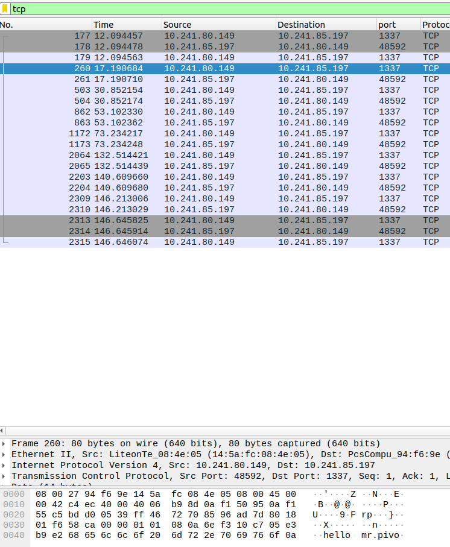

# forensics | s3cr3t

## Information
пожалуйсТа, я умоляю тебя, не раСсказывай этот секРет. Это невероятно важно для меня. Если он станет известен другим, это может повлиять на многие аспекты моей жизни. я доверился тебе, потому что верю в нашу дружбу и в твоё понимание. пожалуйста, подумай о том, как это может отразиться на мне и на нашем доверии. ты мой единственный спасательный круг в этой ситуации. я надеюсь, что ты поймешь и сохранишь эту тайну. пожалуйста.

## Writeup
Видим дамп интернет трафика. Анализируем через wireshark, смотрим tcp пакеты (подсказка есть в описании таска).
В одном из пакетов видим hello mr.pivo. Просмотрим все байты этого потока.

В потоке видим закодированные строки.

U2dmZkNURns= - base64

69 74 73 5f 61 - hex

5f - hex

2d51c255fe39f50f5d2b90b64d018b80 - md5. Лучше всего декодировать md5 через [онлайн сервисы](https://hashes.com/en/decrypt/hash), у которых есть огромная уже декодированных хэшей.

_s3cr3t}

Всё это части флага. Расшифровываем и получаем флаг.

## Flag
`SgffCTF{its_a_b1gg35t_s3cr3t}`
