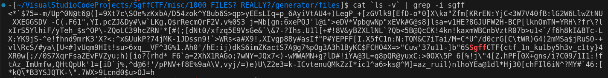

# misc | 1000 FILES? REALLY?

## Information
Вот эта кучка файлов... Разгребёшь?

## Writeup
Видим 1000 файлов, в каждом по 1 символу. Можно предположить, что среди этих всех случайных символов где-то в середине скрывается флаг. Выведем последовательно все символы и попытаемся в них найти флаг по сигнатуре.

Можно написать код на каком-нибудь языке, который это сделает, но проще всего это сделать через пару команд в консоли Linux.
``cat `ls -v` | grep -i sgff``

## Flag
`SgffCTF{ctf_1n_ku1by5h3v_c1ty}`