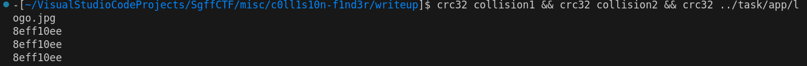

# misc | c0ll1s10n-f1nd3r

## Information
Команда Продам гараж за флаги написали тулзу, которая проверяет их лого на валидность, дабы избежать подделки со стороны конкурентных команд.
Ты же крутой хакер! Сможешь же их обмануть?

P.S. Логотип команды можно достать на лицевой странице соревнования

## Writeup
Берём лого команды "Продам гараж за флаги" и суём в сервис. Понимаем, что за неверный логотип (или любой мусорный файл) сервис нас шлёт куда подальше. Попытаемся подделать лого путём коллизии CRC-32.
Коллизию можно найти через [подобную утилиту](https://github.com/fyxme/crc-32-hash-collider). Можно написать свою [прогу](writeup.go), правда искала [коллизию](collision1) она на моём пк 2 минуты 8 секунд :) Утилита с гитхаба сделала [это](collision2) в два раза быстрее.

У всех файликов одинаковая хэш-сумма => загружаем файл с коллизией => получаем флаг => profit!

## Flag
`SgffCTF{c0ll1s10n_h4ck3r-_-}`