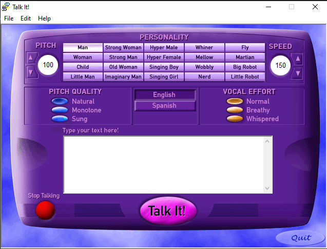

# osint | abc_123_b

## Information
Очень давно мой друг скинул эту аудиозапись с обращением, но голоса из аудио, показались мне очень знакомы из одного трека.
Не могли бы вы помочь найти программу, с помощью которой, было записано это обращение.
Формат флага SgffCTF{name_of_program}

## Writeup
Старая программа созданная для Windows 95 Plus! for kids -> talk it!

Решение таска: В конце аудио файла, записан текст из трека "Crystal Castles - Untrust Us", весь текст в песне был озвучен с помощью этой программы.
Если поискать в интернете информацию, о том как создавался этот трек, мы очень быстро найдём способ создания, а так же через какую программу это делалось/записывалось.

## Flag
`SgffCTF{Talk_It!}`
