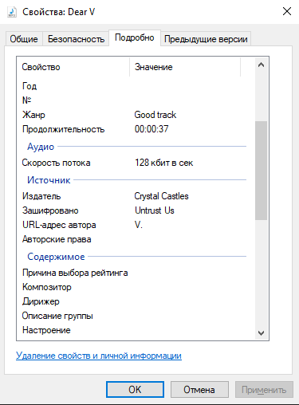

# osint | abc_123_b

## Information
Очень давно мой друг скинул эту аудиозапись с обращением, но голоса из аудио, показались мне очень знакомы из одного трека.
Не могли бы вы помочь найти программу, с помощью которой, было записано это обращение.
Формат флага SgffCTF{name_of_program}

## Writeup
Старая программа созданная для Windows 95 Plus! for kids -> talk it!

Решение таска: Если окунуться в метаданные файла, можно найти название трека и исполнителя, где это программа использовалась для озвучки текста песни.

 
Не трудным поиском в интерене по запросу "Какая программа использовалась для создания голоса в треке "Untrust Us". Мы найдем название этой программы.

## Flag
`SgffCTF{Talk_It!}`
