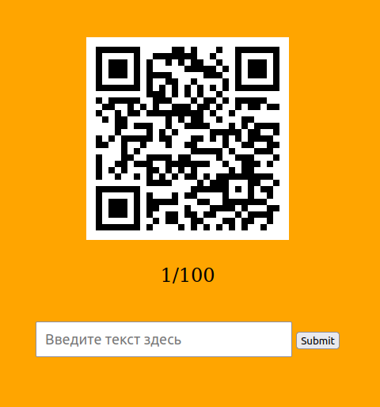
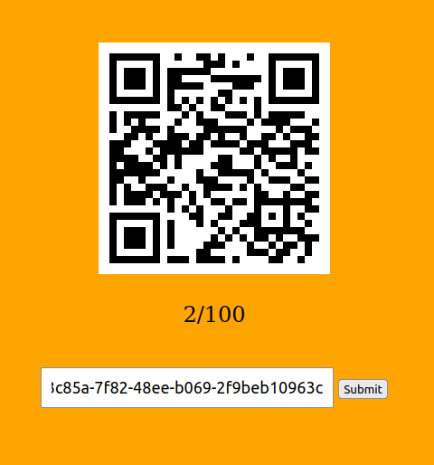

# ppc | qrVachanaly

## Information
Нет под рукой читалки qr'ов. Поможешь?

## Writeup
Видим qr и форму для отправки ответа.

Пробуем декодить qr и отправить содержимое. Счётчик увеличился.

Понимаем, что нам нужно раздекодить 100 qr кодов. После этого на экране появится флаг.

## Flag
`SgffCTF{1_c4n_dec0d3_qr}`