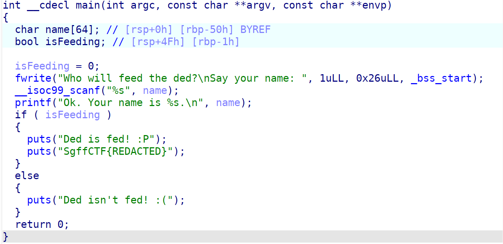
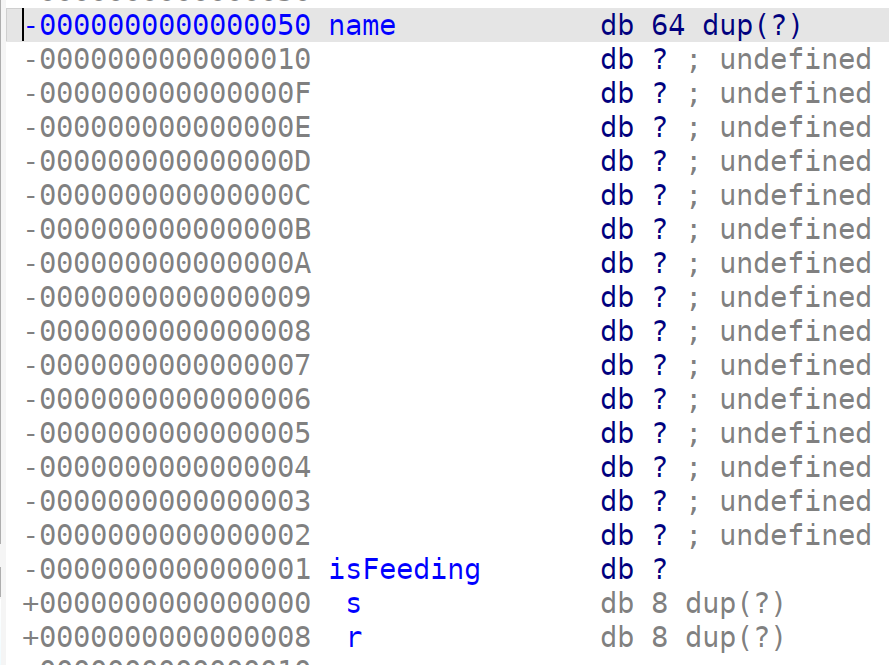

# pwn | feedTheDed

## Information
Накорми деда!

## Writeup

Декомпилируем main, видим уязвимость переполнения буфера на стеке через функцию scanf, которая никак не контроллирует ввод в переменную name. name размером 64 байта, далее isFeeding, которая при любой значении, кроме 0x00, даёт нам в if'е флаг.

Видимо, что после name на стеке лежит ещё 15 байт, а потом лежит isFeeding. Это выравнивание стека, которое делает компилятор. Он выравнивает стек до кол-ва байт кратного 16.

Соответственно нам нужно послать 79 байт и 1 байт, который переполнит isFeeding на любое значение, отличное от 0x00, чтобы сработал if.

`echo -e "aaaabaaacaaadaaaeaaafaaagaaahaaaiaaajaaakaaalaaamaaanaaaoaaapaaaqaaaraaasaaataa\x01" | nc localhost 9002`

## Flag

`SgffCTF{4m___4m_4m}`
