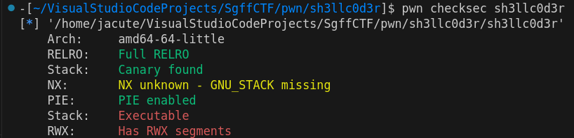
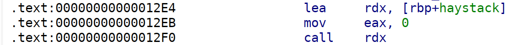
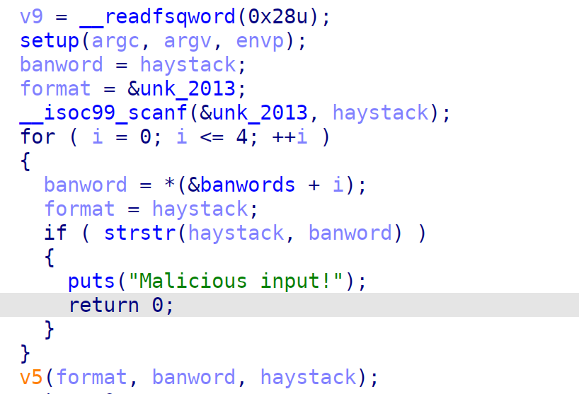
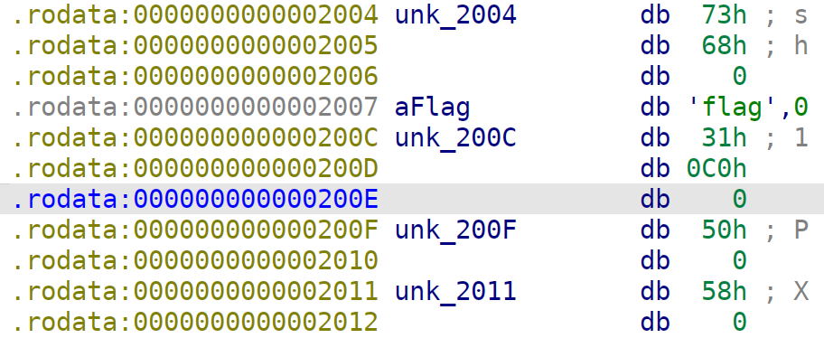

# pwn | sh3llc0d3r

## Information
У меня кончилась фантазия для описания тасков :)

## Writeup

Чекаем защиты бинаря => видим отключенный NX => значит стек исполняемый

Далее смотрим в код. У нас вызывается код от того, что пишется в переменную haystack (так она в ida назвалась у меня, в оригинале это shellcode).

Смотрим дизассемблированный код в IDA => делаем вывод.
Нам необходимо пихнуть на стек шеллкод, который будет лежать в переменной haystack, далее он просто выполнится, но есть одно но
Понимаем, что присутствует некий словарь банвордов - байты, которые нельзя вставлять в шеллкод.

Чекаем банворды в IDA, далее пишем [шеллкод](shellcode/shell.s) и скармливаем его на вход проге. Флаг лежит тут /flag. Profit!

Экслплойт [тут](exploit.py)

## Flag
`SgffCTF{w4r_f0r_t3rr1t0ry}`
