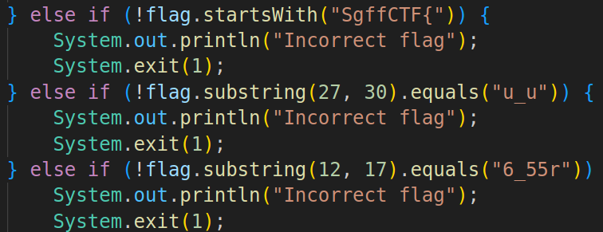

# reverse | flagger

## Information
Слышал, что из jar можно получить исходный код...

## Writeup
Декомпилируем .jar, это можно сделать как через онлайн тулзы, так и через оффлайн. Их много, достаточно просто загуглить "java decompile".
Получаем код, в котором нам нужно обойти все if'ы, чтобы нам вывелся флаг.

## Flag
`SgffCTF{pvpv6_55r12gf115_ppu_up}`