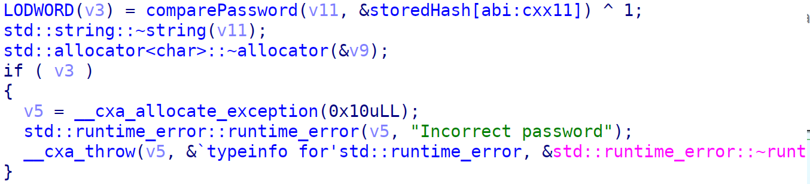
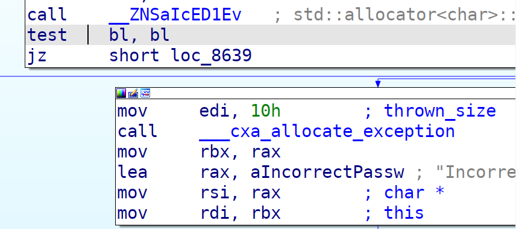
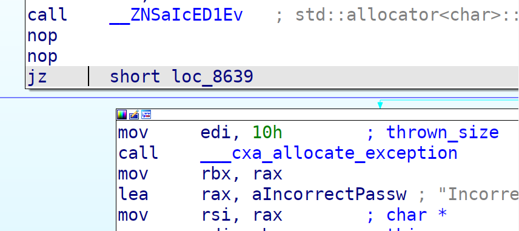

# reverse | jacute-rgz

## Information
Я написал крутое РГЗ по проге во 2 семаке! Попросили сделать пароль на прогу, а я и сделал. Теперь моя программа защищена и её точно никто не сможет использовать, кроме меня. Хе-хе.

Расшифруйте SSJAJD....ASjdsfdNA........JAsdjanjdafDD вторым шифром, далее оберните в SgffCTF{<расшифрованное сообщение>}. Это и будет флаг.

## Writeup
Декомпилим код. Видим в main в самом начале сравнение хэшей. Нам необходимо убрать if, который проверяет переменную v3 на true, в которой хранится результат функции comparePassword. Можно предположить, что comparePassword возвращает false в случае если пароль не является валидным. Также можно заметить, что v3 ксорит на 1 результат функциии. Соответственно при возврате false из функциюю comparePassword мы делаем ^ 1 и получаем true. Из-за этого мы заходим в if и программа завершается со словами "Incorrect password".



Пропатчим бинарь, чтобы убрать этот if совсем. Для этого заменим инструкцию test на nop.




Пропатченный бинарь [тут](patched).

Теперь какой бы мы пароль ни ввели, мы всё равно получим доступ к программе.

Расшифровываем вторым шифром наше сообщение => получаем флаг => profit!
```
Password: 123rfsy53fds
  ____ _       _                   
 / ___(_)_ __ | |__   ___ _ __ ___ 
| |   | | '_ \| '_ \ / _ \ '__/ __|
| |___| | |_) | | | |  __/ |  \__ \
 \____|_| .__/|_| |_|\___|_|  |___/
        |_|                        
=== MENU ===
1. Gronsfeld cipher
2. Matrix cipher
3. RC6 cipher
4. Print this message
5. Exit
Choice: 2
Input file: input/matrix_input.txt
Output file: output/matrix_output.txt
=== Encrypt/Decrypt ===
1. Encrypt
2. Decrypt
3. Print this message
4. Back
Choice: 2
=== File/Console input ===
1. File
2. Console input
Choice: 2
Ciphertext: SSJAJD....ASjdsfdNA........JAsdjanjdafDD
Result: djanjdasjdsfdfASJAJNDJASSDAD
```


## Flag
`SgffCTF{djanjdasjdsfdfASJAJNDJASSDAD}`