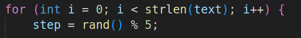
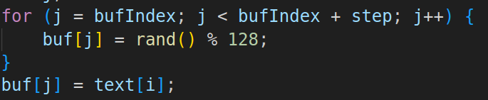
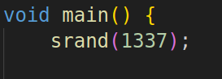

# reverse | prek

## Information
На днях посмотрел Кунг фу панду, но так и не понял, почему случайности не случайны.

## Writeup

Флаг шифруется и записывается в файл output.txt. Нужно написать расшифровщик.
Шифровка происходит следующим образом:
Берётся рандомный step.

Далее записываются случайные байты, их кол-во равно step. Потом после мусорных байт пишется символ флага.

Step можно предугадать из-за предустановленного seed. srand(1337);

