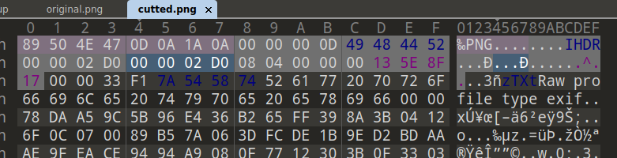
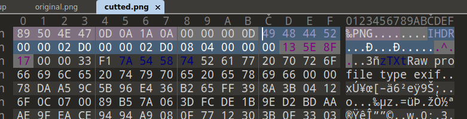
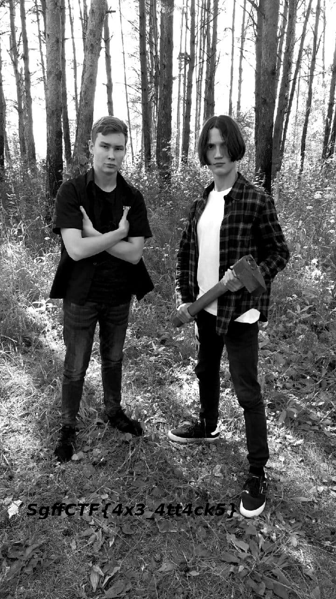

# steg | f0r35t

## Information
Вам ведь тоже кажется, что фотография обрезана?

## Writeup
Увеличиваем высоту фото.

Считаем crc-32 от этих байт и заменяем его. Фиолетовые байты - crc-32.

Profit!

Подробнее про структуру png можно узнать [здесь](https://habr.com/ru/articles/130472/).

## Flag
`SgffCTF{4x3_4tt4ck5}`