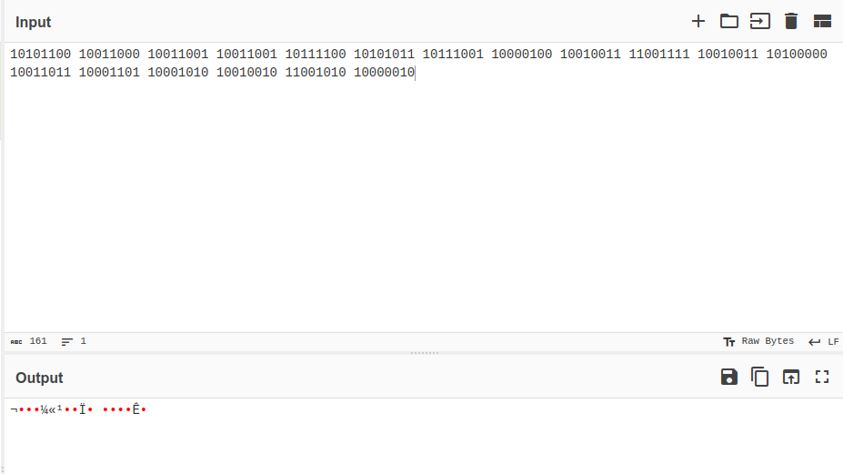
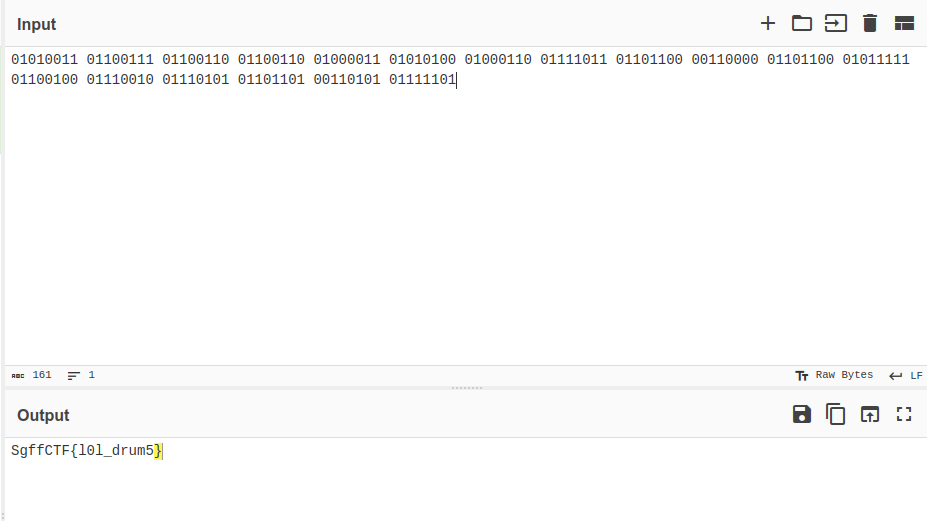

# steg | str4ng3-drum-p4rt

## Information
Что за кринж ударная партия? Знал я одного ударника якута, сейчас он вмиг всё исправит...

## Writeup
Слушаем эту волшебную партию. Понимаем, что это какой-то бессвязный шлак из двух звуков. Вспоминаем, что существует двоичная система счисления. Переписываем все звуки в последовательности по 8 бит. Осталось два варианта перебрать.

1. 1 - бочка, 0 - малый барабан

2. 0 - бочка, 1 - малый барабан

P. S. На самом деле легко понять, что 1 вариант вообще не может подходить в принципе, ибо все символы в ascii имеют число 0-127. 128 = 0b10000000 => оно выходит за рамки ascii и не может быть представлено в этой кодировке как печатаемый символ.

## Flag
`SgffCTF{l0l_drum5}`