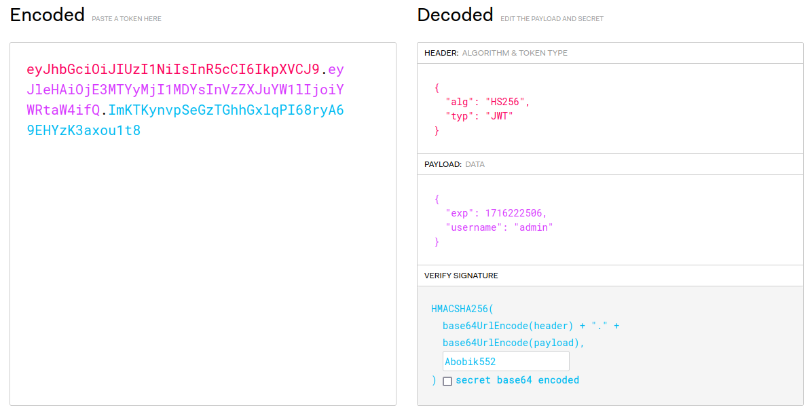

# web | adminIsBusy

## Information
Слышал три буквы J W T. Говорят, что какой-то ключ есть и его никому нельзя показывать... А я и не собираюсь!

## Writeup

Мы получаем флаг, если в payload у jwt лежит username равный admin. 

В docker-compose.yml явно видно, что jwt ключ захардкожен.
```
environment:
      - FLAG=SgffCTF{REDACTED}
      - JWT_KEY=Abobik552
```

Если мы знаем ключ, то мы сами можем подписать себе любой jwt токен с любым username'ом.

Эксплуатируем.

Регаем пользователя, берём его access_token и на основе его подписываем себе новый, с username равным admin.




Далее вставляем новый access_token в cookie, обновляем страницу, получаем флаг :P

## Flag
`SgffCTF{jwt_t0ken5_4r3_s1mpl3}`
