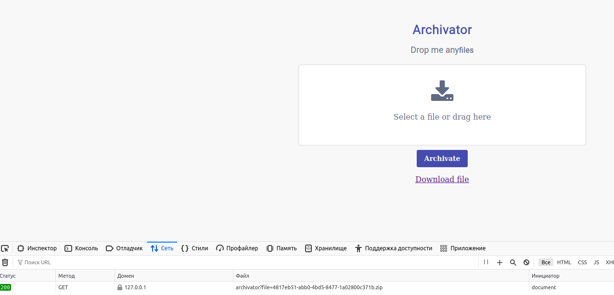
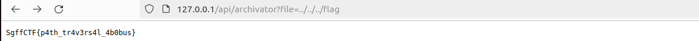

# web | archivateMePlz

## Information
Придумал крутой и безопасный сервис для архивации! Вы точно не сможете ОБОЙТИ защиту и получить мои файлы МУХАХАХАХАХАХХАХА.

## Writeup

Флаг лежит в /flag. Нам нужно его прочитать.
Пробуем заархивировать файлы, скачиваем архив и смотрим на url, по которому скачивается архив.



Понимаем, что здесь уязвимость Path Traversal, получаем флаг.



## Flag
`SgffCTF{p4th_tr4v3rs4l_4b0bus}`

## Comment

Уязвимая функция чтения файла:
```
func getArchive(w http.ResponseWriter, r *http.Request) {
	w.Header().Set("Access-Control-Allow-Origin", "*")

	name := r.URL.Query().Get("file")
	if name == "" {
		http.Error(w, "File name not provided", http.StatusBadRequest)
		return
	}

	path := filepath.Join("archives", name)
	f, err := os.Open(path)
	if err != nil {
		http.Error(w, "Unable to open archive", http.StatusInternalServerError)
		return
	}
	defer f.Close()

	http.ServeContent(w, r, name, time.Time{}, f)
}
```

Уязвимая функция загрузки файла (для получения флага она не нужна):
```
func saveFile(fileName string, data []byte) (string, error) {
	filePath := filepath.Join("uploads", fileName)

	file, err := os.OpenFile("uploads/"+fileName, os.O_WRONLY|os.O_CREATE|os.O_TRUNC, 0644)
	if err != nil {
		return "", err
	}
	defer file.Close()

	_, err = file.Write(data)
	if err != nil {
		return "", err
	}

	return filePath, nil
}
```