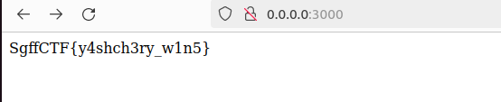

# web | buycalPower

## Information
После столетий тайных наблюдений, ящеры узнали о священных свойствах байкальской воды. Они разработали хитроумный план: используя свои навыки в программировании, они взломали систему управления водоснабжением и попытались перенаправить потоки воды в своё убежище.
Помоги ящерам, дабы они наконец смогли испить водицы священной!

## Writeup
Смотрим исходнички: видим, что при инициализации сессии ей присваивается свойство lakes, в котором три озера и каждому присваивается свой пустой объект.

Дабы получить флаг, нам нужно выставить свойство isDrinked объекту buycal в true.

Но просто так мы этого сделать не можем, есть проверка на buycal.

В таком случае мы можем загрязнить прототип послав GET на /drink?lake=\_\_proto\_\_ и получить флаг, послав GET на /.

 

## Flag
`SgffCTF{y4shch3ry_w1n5}`