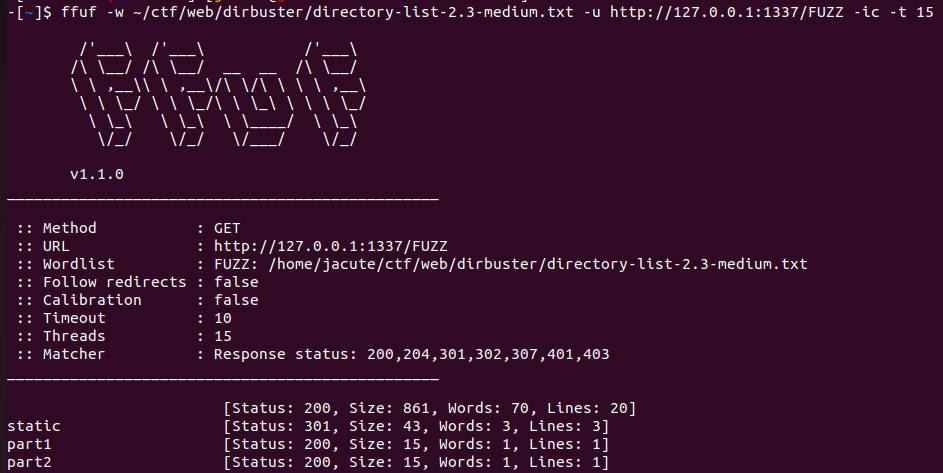
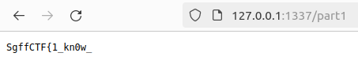
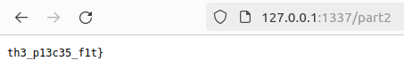

# web | ffuf is the best friend

## Information
Я спрятал флаг ФЛАГ в СЕКРЕТНОМ месте. УАХУХУХУХАУХАХУхУахухаух

## Writeup
- Брутим route'ы на веб-сервере. Можно использовать разные инструменты по типу dirsearch, dirbuster, dirb и т.п. Может даже есть какие-то онлайн тулзы, но из названия подсказка, что лучше всего использовать ffuf.

- Видим /part1 и /part2. Делаем запрос к ним на сайте. склеиваем флаг из частей.

## Flag
`SgffCTF{1_kn0w_th3_p13c35_f1t}`
